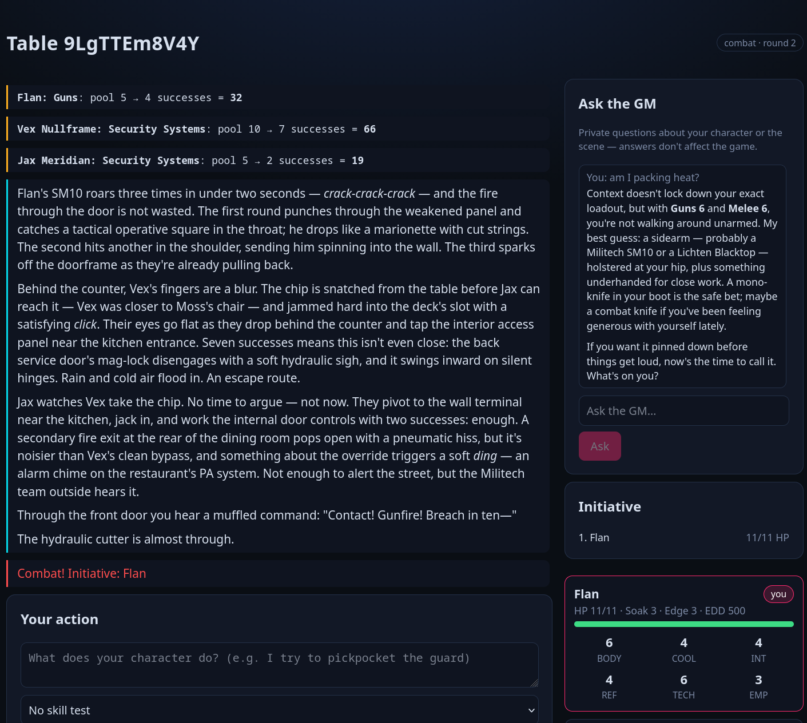

# auto-punk

A browser-based tabletop RPG platform with an **AI game master** and a mix of **AI + human players**. No accounts: the host creates a room, shares a link, and players join with just a name. v1 ships **Cyberpunk 2020**, driven by a local [LM Studio](https://lmstudio.ai) LLM (`qwen3.8-27b`).



## How it works

The host creates a room and gets a shareable link (the room's unique instance id). Players join over the network, build characters (humans via a guided form; AI players get LLM-generated sheets from a persona), and then play. The **AI GM runs structured rounds**: every player declares an action, the rules engine rolls the dice, and the GM narrates the outcome and advances the story — with full state and action-log tracking that survives refreshes and restarts.

Key design points:

- **Server is the single source of truth.** It owns game state, runs the rules engine, sequences rounds as transactions, and makes all LLM calls. Browsers are thin clients that render state and submit actions over WebSocket.
- **Dice are never invented by the model.** Rolls come from a deterministic, seeded rules engine; results are handed to the LLM so it narrates outcomes without deciding them.
- **Resumable.** Rooms persist as JSON on disk and hydrate back into memory on boot.

## Requirements

- A recent Node.js (the plan targets Node 26; anything with native `fetch` works — Node ≥ 18).
- [LM Studio](https://lmstudio.ai) running locally with the **`qwen3.8-27b`** model loaded, serving its OpenAI-compatible API at `http://localhost:1234`.

## Getting started

```bash
# 1. Install dependencies (npm workspaces)
npm install

# 2. Make sure LM Studio is running with qwen3.8-27b on localhost:1234

# 3. Run the server + web client together in development
npm run dev
```

`npm run dev` starts both the game server (default `http://localhost:8787`) and the Vite web app (`http://localhost:5173`). Open the web URL, create a room, copy the link, and play.

### Other commands

| Command | Description |
|---|---|
| `npm run dev` | Run server + web client concurrently (development) |
| `npm start` | Run only the game server |
| `npm run build:web` | Build the React app to `apps/web/dist` |
| `npm test` | Unit tests for the shared rules engine (`node --test`) |
| `npm run typecheck` | Type-check the whole monorepo with `tsc` |

### Production-style single process

Build the web app, then start the server — it serves the built UI and the WebSocket from one port:

```bash
npm run build:web
npm start          # http://localhost:8787
```

## Configuration (server environment variables)

| Variable | Default | Description |
|---|---|---|
| `PORT` | `8787` | HTTP + WebSocket port |
| `HOST` | `0.0.0.0` | Bind address |
| `DATA_DIR` | `<repo>/data/` | Where room JSON files are persisted |
| `LM_STUDIO_URL` | `http://localhost:1234/v1` | OpenAI-compatible base URL of LM Studio |
| `LM_API_KEY` | `lm-studio` | API key (LM Studio ignores it, but the client requires one) |
| `LM_MODEL` | `qwen3.8-27b` | Model name to request |
| `MAX_EVENTS_IN_STATE` | `200` | How many recent events are included in each state broadcast |
| `WEB_DIST` | `<repo>/apps/web/dist` | Directory of the built web app to serve (if present) |

## Project structure

```
auto-punk/
  package.json            # npm workspaces root + shared scripts
  packages/shared/        # Pure TS, no deps: types + Cyberpunk 2020 rules engine + dice
    src/{types.ts, dice.ts, cyberpunk2020.ts, gameSystem.ts}
    test/*.test.ts        # Deterministic unit tests (node --test)
  apps/server/            # Node + Fastify + ws: authoritative state, LLM orchestration, JSON store
    src/{index.ts, config.ts, store.ts, id.ts, gameServer.ts}
    src/llm/{llmClient.ts, prompts.ts}
    src/socket/handler.ts
    scripts/{llm-ping.ts, ws-smoke.mjs, ws-e2e.mjs}   # Dev checks (see below)
  apps/web/               # React + Vite + Zustand thin client over WebSocket
    src/{main.tsx, App.tsx, screens/, components/, store/useGameStore.ts}
```

## Testing & dev scripts

- **Unit tests** — `npm test` runs the pure rules engine (dice rolls, success/fumble counting, opposed rolls) with a deterministic seeded RNG. No LLM or network required.
- **`apps/server/scripts/llm-ping.ts`** — one real structured-output call through the server's LLM client against LM Studio.
- **`apps/server/scripts/ws-smoke.mjs`** — exercises the non-LLM room lifecycle (create → configure AI → create character) over a live WebSocket.
- **`apps/server/scripts/ws-e2e.mjs`** — full end-to-end run against a live LM Studio, exercising every LLM path through one complete round.

## Notes & limitations (v1)

- Single RPG system: Cyberpunk 2020 only (the architecture is game-pluggable via the `GameSystem` interface).
- No accounts/auth — identity is a client-generated seat token stored in `localStorage`.
- Local LM Studio required; no cloud hosting or mobile-native support.

See [PLAN.md](./PLAN.md) for the full implementation plan, decisions, and milestones.
